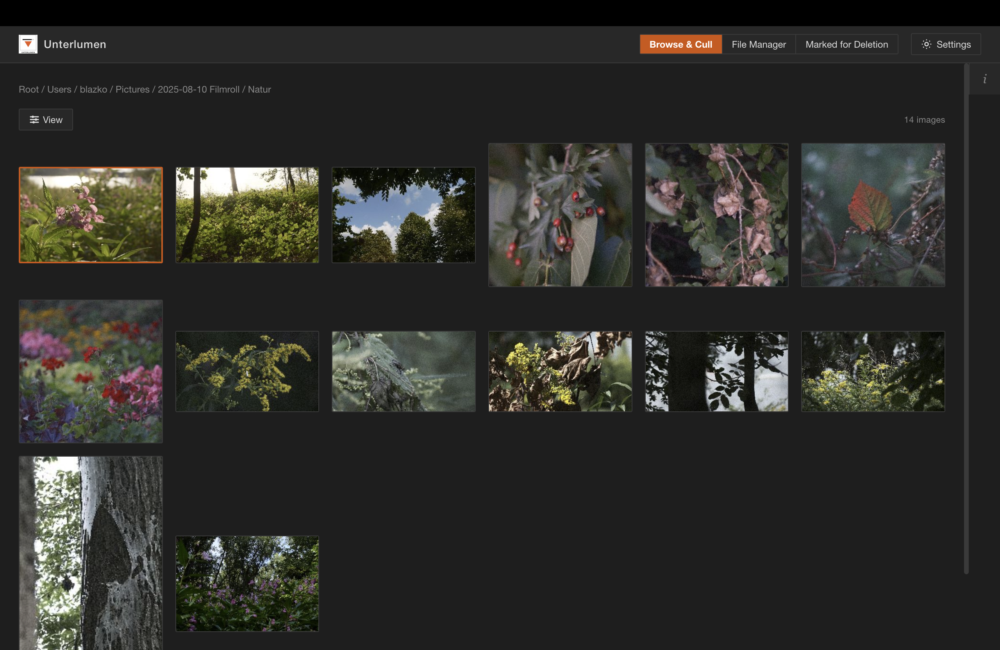
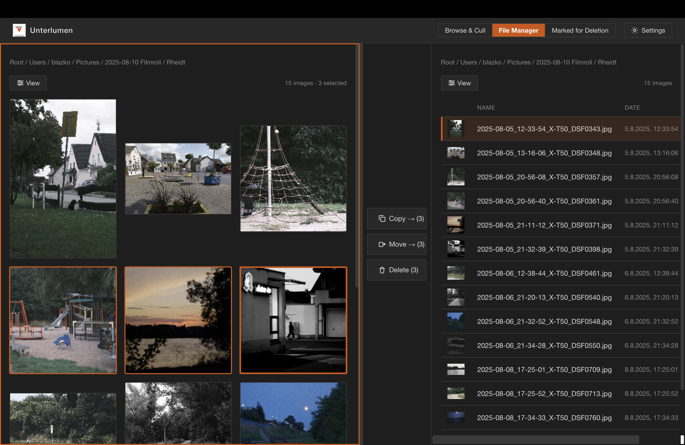
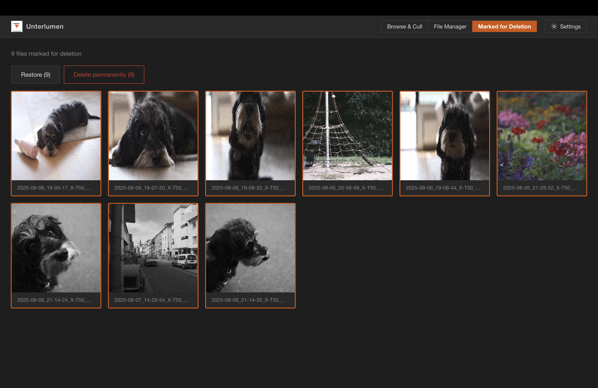

# Unterlumen

A photo browser and culler that runs as a local web server. Browse your photo library in the browser, view images full-screen, and organize files using a dual-pane File Manager interface.

## Features

- **Browse & Cull mode** — Grid or list view of photos in a directory with breadcrumb navigation
- **File Manager mode** — Dual-pane Norton Commander-style layout for copying/moving files between directories
- **Waste bin** — Mark photos for deletion, review in a dedicated view, restore or permanently delete
- **Image viewer** — Full-screen image view with keyboard navigation
- **Info panel** — Collapsible sidebar showing file metadata and EXIF data (camera, exposure, dates, GPS). Available in browse and fullscreen viewer
- **Sorting** — By name, date, or size, ascending or descending
- **Multi-select** — Click, Shift+click, Ctrl/Cmd+click for bulk operations
- **Status bar** — Live image count and selection count in every pane
- **EXIF/HEIF orientation** — Portrait and rotated images display correctly
- **HEIF support** — Automatic conversion via ffmpeg (requires ffmpeg installed)
- **Formats** — JPEG, PNG, GIF, WebP natively; HEIF/HEIC/HIF via ffmpeg

### Screenshots

Browse mode:


Fullscreen, here with optional file and EXIF data)::


File manager  ("Commander style") mode:


Waste bin (marked for deletion during culling) mode:


## Requirements

- Go 1.21+
- ffmpeg (optional, only needed for HEIF/HEIC/HIF files)

## Install

```
go build -o unterlumen .
```

## Usage

```
./unterlumen [flags] [directory]
```

**Arguments:**

| Argument | Description |
|----------|-------------|
| `directory` | Directory to start in (default: home directory). Navigation is unrestricted — users can navigate to any directory on the filesystem. |

**Flags:**

| Flag | Default | Description |
|------|---------|-------------|
| `-port` | `8080` | HTTP server port (env: `UNTERLUMEN_PORT`) |
| `-bind` | `localhost` | Bind address (`0.0.0.0` for remote access) (env: `UNTERLUMEN_BIND`) |

**Environment variables:**

| Variable | Description |
|----------|-------------|
| `UNTERLUMEN_PORT` | HTTP server port. Overridden by `-port` flag. |
| `UNTERLUMEN_BIND` | Bind address. Overridden by `-bind` flag. |
| `UNTERLUMEN_ROOT_PATH` | Restrict navigation to this directory. The server starts here and users cannot navigate above it. Takes effect only when no `directory` argument is provided. |

**Path resolution priority:**

1. **Command-line argument** — starts in the given directory; navigation unrestricted (up to filesystem root)
2. **`UNTERLUMEN_ROOT_PATH` env var** — starts there and restricts navigation to that directory
3. **Default** — starts in the user's home directory; navigation unrestricted

**Examples:**

```
# Browse photos in ~/Pictures; navigate freely around the filesystem
./unterlumen ~/Pictures

# Use a different port
./unterlumen -port 3000 ~/Pictures

# Allow access from other machines on the network
./unterlumen -bind 0.0.0.0 ~/Pictures

# Restrict navigation to /mnt/photos (useful for self-hosted setups)
UNTERLUMEN_ROOT_PATH=/mnt/photos ./unterlumen

# Run on port 3000 via environment variable
UNTERLUMEN_PORT=3000 ./unterlumen ~/Pictures
```

Then open `http://localhost:8080` in your browser.

## Keyboard Shortcuts

| Key | Action |
|-----|--------|
| Arrow keys | Navigate grid/list in browse view; prev/next in image viewer |
| Enter | Open focused folder or image |
| Space | Toggle selection of focused item |
| Escape | Close viewer / go up a directory |
| `I` | Toggle info panel |
| Backspace / Delete / Cmd+D | Mark selected files for deletion |
| Cmd/Ctrl+A | Select all files in current pane |
| Cmd/Ctrl+1/2/3 | Switch to Browse & Cull / File Manager / Marked for Deletion |
| Tab | Switch panes in File Manager mode |
| F5 | Copy selected files (File Manager) |
| F6 | Move selected files (File Manager) |
| Ctrl/Cmd + Click | Toggle selection |
| Shift + Click | Range selection |

## Documentation

- [Changelog](CHANGELOG.md)
- [Architecture (arc42)](doc/architecture/arc42.md)
- Architecture Decision Records:
  - [ADR-0001](doc/architecture/adr/0001-go-http-server-with-browser-ui.md) — Go HTTP server with browser UI
  - [ADR-0002](doc/architecture/adr/0002-no-persistence.md) — No persistence, in-memory state only
  - [ADR-0003](doc/architecture/adr/0003-exif-thumbnails.md) — EXIF embedded thumbnails
  - [ADR-0004](doc/architecture/adr/0004-heif-via-ffmpeg.md) — HEIF via ffmpeg
  - [ADR-0005](doc/architecture/adr/0005-commander-style-culling.md) — Commander-style dual-pane culling
  - [ADR-0006](doc/architecture/adr/0006-no-authentication.md) — No authentication
  - [ADR-0007](doc/architecture/adr/0007-vanilla-frontend.md) — Vanilla HTML/JS/CSS frontend
  - [ADR-0008](doc/architecture/adr/0008-dieter-rams-design-principles.md) — Dieter Rams' design principles
  - [ADR-0009](doc/architecture/adr/0009-soft-delete-waste-bin.md) — Soft delete with frontend-only waste bin
  - [ADR-0010](doc/architecture/adr/0010-root-path-resolution.md) — Root path resolution and navigation boundary

## Notes

- All state is in-memory and discarded on exit — no database, no config files written
- By default the server binds to `localhost` only; use `-bind 0.0.0.0` if you need remote access (no authentication is provided)
- HEIF/HEIC/HIF conversion shells out to ffmpeg; file paths are passed as arguments (not interpolated into a shell string)
- `UNTERLUMEN_ROOT_PATH` is ignored when a directory argument is also provided on the command line
