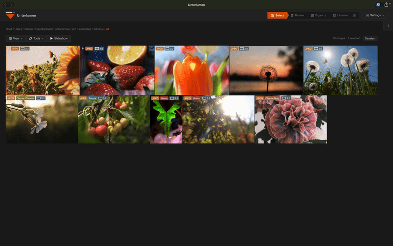
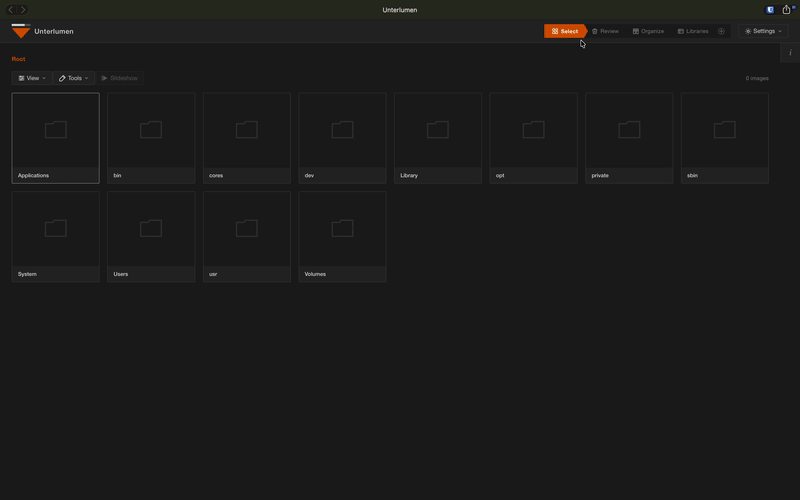

# Unterlumen

[](https://github.com/bjblazko/unterlumen/actions/workflows/e2e.yml)
[](LICENSE)
[](https://go.dev)

A photo browser and culler that runs as a local web server. Browse your photo library in the browser, view images full-screen, and organize files using a dual-pane File Manager interface.

## Contents

- [Features](#features)
  - [Browse mode](#browse-mode)
  - [Slideshow](#slideshow)
  - [Review (culling)](#review-culling)
  - [Organize](#organize)
  - [Tools](#tools)
  - [Digital Asset Management (DAM)](#digital-asset-management-dam-optional)
- [Install](#install)
  - [macOS](#macos)
  - [Windows](#windows)
  - [Linux](#linux)
  - [Docker / Podman](#docker--podman)
  - [Build from source](#build-from-source)
- [Usage](#usage)
  - [Advanced usage (command line)](#advanced-usage-command-line)
- [Docker / Podman](#docker--podman-1)
- [Keyboard Shortcuts](#keyboard-shortcuts)
- [Documentation](#documentation)
- [Development & Testing](#development--testing)
- [Notes](#notes)

## Features

- **Browse & Cull mode** — Justified, grid, or list view of photos in a directory with breadcrumb navigation
- **File Manager mode** — Dual-pane Norton Commander-style layout for copying/moving files between directories
- **Waste bin** — Mark photos for deletion, review in a dedicated view, restore or permanently delete
- **Libraries (DAM)** — Index a folder into a SQLite library (no CGo). Photos are identified by SHA-256 so metadata survives renames. Full-text EXIF search, key/value annotations, HQ thumbnails, and re-index progress via Server-Sent Events. Library data stored in `~/.unterlumen/libraries/<id>/` (overridable with `--lib-dir` / `UNTERLUMEN_LIB_DIR`)
- **Publish to Channels** — From library mode, select photos and record where and when they were published. Writes an XMP sidecar (`.xmp`) using a custom `xmlns:ul` namespace — non-destructive and portable. Supports named accounts (e.g. two Mastodon logins), optional grouped post IDs for carousels, back-dating, and platform-optimised export (channel presets: Instagram 1080px, Mastodon 1920px, Website 2400px). Channel settings managed via a dedicated UI; stored globally in `~/.unterlumen/channels.json`
- **Image viewer** — Full-screen image view with keyboard navigation
- **Crop tool** — Interactive crop in the fullscreen viewer. Draw a rectangle, pick an aspect ratio (free, standard, or cinema formats), and save in-place. All metadata including Fujifilm film simulation is preserved via exiftool
- **Info panel** — Collapsible sidebar showing file metadata, EXIF data, and location map for GPS-tagged photos. Available in browse and fullscreen viewer
- **Convert & Export** — Export selected images to JPEG, PNG, or WebP with quality control, flexible scaling (original, percentage, max dimension), and EXIF metadata options (strip, keep, or keep without GPS). Shows per-file estimated output size and pixel dimensions. Saves to a local folder or downloads as a ZIP; server mode (`UNTERLUMEN_ROOT_PATH`) is ZIP-only
- **Batch rename** — Rename multiple photos using EXIF-based patterns (date, camera, film simulation, etc.) with color-coded draggable token pills, live preview, conflict resolution, and progress indication. Also includes a simple single-file rename option
- **Geolocation editing** — Set or remove GPS coordinates on one or more images via an interactive map picker (requires exiftool)
- **Thumbnail quality** — Standard (fast EXIF thumbnails) or High (full-image decode with bicubic resampling for retina displays), selectable in Settings
- **Sorting** — By name, date, or size, ascending or descending
- **Multi-select** — Click, Shift+click, Ctrl/Cmd+click for bulk operations
- **Status bar** — Live image count and selection count in every pane
- **EXIF/HEIF orientation** — Portrait and rotated images display correctly
- **HEIF support** — Automatic conversion via ffmpeg (requires ffmpeg installed)
- **Fujifilm film simulation** — Film simulation name (e.g. Classic Chrome, Velvia, Acros) shown in the info panel and as a grid overlay badge for Fujifilm images
- **Formats** — JPEG, PNG, GIF, WebP natively; HEIF/HEIC/HIF via ffmpeg

### Screenshots

#### Browse mode:

- theme switching
- justified/list/grid view
- show EXIF/metadata
- large/fullscreen viewing
    - app header visible/hidden
    - metadata (including geolocation) visible/hidden
    - filmstrip visible/hidden


#### Slideshow


#### Review (culling)

- review/browse photos in grid or fullscreen
- mark candidates for deletions using del/backspace
- review them
- select the ones to finally delete
- select the ones to keep when in doubt



#### Organize

- two panes: source and destination
- just like Nortcon Commander, Midnight Commander, Total Commander etc.
- copy or move files
- create folders etc.
- shortcuts for library locations




#### Tools

- set or remove geolocation
    
- batch renaming with metadata fields in filename
    
- export and convert, including as Zip file
    


#### Digital Asset Management (DAM, optional)

- fast thumbnails
- multiple libraries
- search/filter within or accross libraries
    - by aperture
    - by focal lenth (incl. option to recalculate to 35mm equivalent)
    - by camera and lens
    - by Fujifilm film simulation (if you have them)
- multiple statistics
    
- statistics over time
    

## Install

### Pre-built binary (recommended)

Download the latest release for your platform from the [Releases page](https://github.com/bjblazko/unterlumen/releases) and extract the archive — you will get a single file called `unterlumen` (or `unterlumen.exe` on Windows).

The installer sets Unterlumen up as a proper desktop application with an icon, so you can open it from Spotlight, Launchpad, or the Start Menu just like any other app — no terminal needed afterwards.

#### macOS

1. **Open Terminal** — press **Cmd + Space**, type `Terminal`, and press **Enter**. A window with a text prompt appears.

2. **Go to your Downloads folder** — type the following and press **Enter**:
   ```
   cd ~/Downloads
   ```

3. **Allow the file to run** — type the following two commands, pressing **Enter** after each:
   ```
   xattr -d com.apple.quarantine unterlumen
   chmod +x unterlumen
   ```
   The first command removes macOS's download restriction — macOS blocks programs downloaded from the internet by default, and this tells it the file is safe to run. The second makes the file executable.

4. **Run the installer** — type the following and press **Enter**:
   ```
   ./unterlumen -desktop-install
   ```

5. **Answer the three prompts** — press **Enter** at each one to accept the default, or type your own value before pressing Enter:
   - **Port** — the internal network port the app uses (default: `8090`; fine to leave as-is unless something else is already using that port)
   - **Photos directory** — the folder Unterlumen opens by default (default: `~/Pictures`). If you want to be able to browse **any folder** on your Mac — not just Pictures — type `/` here. That sets the root of your entire filesystem as the starting point and lets you navigate anywhere.
   - **Library directory** — where Unterlumen stores its database and thumbnails (default: `~/Library/Application Support/Unterlumen`)

6. **Done.** Unterlumen now appears in **Spotlight** (press **Cmd + Space** and type "Unterlumen") and in **Launchpad**. You can close the Terminal window.

#### Windows

1. **Open PowerShell** — press the **Windows key**, type `PowerShell`, and press **Enter**. A blue window with a text prompt appears.

2. **Go to your Downloads folder** — type the following and press **Enter**:
   ```
   cd $HOME\Downloads
   ```

3. **Run the installer** — type the following and press **Enter**:
   ```
   .\unterlumen.exe -desktop-install
   ```

4. **Answer the three prompts** — press **Enter** at each one to accept the default, or type your own value before pressing Enter:
   - **Port** — the internal network port the app uses (default: `8090`)
   - **Photos directory** — the folder Unterlumen opens by default (default: your Pictures folder). If you want to browse **any folder** on a drive, type the drive root here — for example `C:\` for your main drive, or `D:\` for a second drive. You can only browse within one drive root at a time; to switch drives, re-run `-desktop-install` and change this setting.
   - **Library directory** — where Unterlumen stores its database and thumbnails (default: `%APPDATA%\Unterlumen`)

5. **Done.** Unterlumen now appears in the **Start Menu**. You can close the PowerShell window.

#### Linux

1. **Open a terminal** — on GNOME, press the **Super key** (the Windows key on most keyboards), type `Terminal`, and press **Enter**. On KDE, right-click the desktop and choose **Open Terminal**. The terminal name varies by distribution (GNOME Terminal, Konsole, xterm, etc.) but any of them will work.

2. **Go to your Downloads folder** — type the following and press **Enter**:
   ```
   cd ~/Downloads
   ```

3. **Allow the file to run** — type the following and press **Enter**:
   ```
   chmod +x unterlumen
   ```

4. **Run the installer** — type the following and press **Enter**:
   ```
   ./unterlumen -desktop-install
   ```

5. **Answer the three prompts** — press **Enter** at each one to accept the default, or type your own value before pressing Enter:
   - **Port** — the internal network port the app uses (default: `8090`)
   - **Photos directory** — the folder Unterlumen opens by default (default: `~/Pictures`). If you want to be able to browse **any folder** on your system — not just Pictures — type `/` here. That sets the filesystem root as the starting point and lets you navigate anywhere.
   - **Library directory** — where Unterlumen stores its database and thumbnails (default: `~/.local/share/unterlumen`)

6. **Done.** Unterlumen now appears in your application launcher (GNOME Activities, KDE application menu, etc.). You can close the terminal window.

#### Re-installing or updating

To update Unterlumen, download the new binary and run `-desktop-install` again — it overwrites the previous installation automatically.

### Docker / Podman

Pre-built images for `linux/amd64` and `linux/arm64` are on the GitHub Container Registry and include ffmpeg and exiftool — no separate install needed. Jump to the [Docker / Podman](#docker--podman) section below.

### Build from source

Requires Go 1.21+.

```
cd src && go build -o ../unterlumen .
```

### Optional dependencies

- **ffmpeg** — required for HEIF/HEIC/HIF support
- **exiftool** — required for Set/Remove Geolocation, Batch Rename, and Export EXIF copy/GPS-strip

## Usage

Once installed with `-desktop-install`, just open Unterlumen from your OS launcher (Spotlight / Launchpad on macOS, Start Menu on Windows, application grid on Linux). The app opens in its own window and closes cleanly when you are done.

### Advanced usage (command line)

You can also run Unterlumen directly from the terminal without installing it. This is useful for scripting, server deployments, or trying it out before installing.

```
./unterlumen [flags] [directory]
```

**Arguments:**

| Argument | Description |
|----------|-------------|
| `directory` | Directory to start in (default: home directory). Navigation is unrestricted — users can navigate to any directory on the filesystem. |

**Flags:**

| Flag | Default | Description |
|------|---------|-------------|
| `-port` | `8080` | HTTP server port (env: `UNTERLUMEN_PORT`) |
| `-bind` | `localhost` | Bind address (`0.0.0.0` for remote access) (env: `UNTERLUMEN_BIND`) |
| `-lib-dir` | `~/.unterlumen` | Root directory for library data (env: `UNTERLUMEN_LIB_DIR`) |
| `-desktop` | off | Open in a Chrome/Chromium app window (no URL bar). Server exits when the window is closed. Falls back to the default browser if Chrome is not found. |
| `-desktop-install` | — | Interactive installer: sets up a native app launcher with icon (macOS `.app`, Linux `.desktop`, Windows Start Menu shortcut). |

**Environment variables:**

| Variable | Description |
|----------|-------------|
| `UNTERLUMEN_PORT` | HTTP server port. Overridden by `-port` flag. |
| `UNTERLUMEN_BIND` | Bind address. Overridden by `-bind` flag. |
| `UNTERLUMEN_ROOT_PATH` | Restrict navigation to this directory. The server starts here and users cannot navigate above it. Takes effect only when no `directory` argument is provided. |
| `UNTERLUMEN_LIB_DIR` | Root directory for library data (SQLite databases, thumbnails, channel exports). Default: `~/.unterlumen`. Overridden by `-lib-dir` flag. |

**Path resolution priority:**

1. **Command-line argument** — starts in the given directory; navigation unrestricted (up to filesystem root)
2. **`UNTERLUMEN_ROOT_PATH` env var** — starts there and restricts navigation to that directory
3. **Default** — starts in the user's home directory; navigation unrestricted

**Examples:**

```
# Browse photos in ~/Pictures and open in the browser manually
./unterlumen ~/Pictures

# Open as a desktop app window (Chrome required; falls back to default browser)
./unterlumen -desktop ~/Pictures

# Use a different port
./unterlumen -port 3000 ~/Pictures

# Allow access from other machines on the network
./unterlumen -bind 0.0.0.0 ~/Pictures

# Restrict navigation to /mnt/photos (useful for self-hosted setups)
UNTERLUMEN_ROOT_PATH=/mnt/photos ./unterlumen
```

Then open `http://localhost:8080` in your browser (or whichever port you configured).

## Docker / Podman

Pre-built images for `linux/amd64` and `linux/arm64` are published to the GitHub Container Registry and include ffmpeg and exiftool.

```
docker run -p 8080:8080 -v /path/to/photos:/photos ghcr.io/bjblazko/unterlumen:latest
```

**Podman:** The container runs as UID 1000, but on macOS the mounted directory is owned by your host user (typically UID 501 or 502). Pass `--user $(id -u):$(id -g)` to run as your own UID:

```
podman run --user $(id -u):$(id -g) -p 8080:8080 -v /path/to/photos:/photos:ro ghcr.io/bjblazko/unterlumen:latest
```

Then open `http://localhost:8080`.

By default the container runs in **server mode** — navigation is locked to `/photos`. Override environment variables to change behaviour:

| Variable | Default (container) | Description |
|----------|---------------------|-------------|
| `UNTERLUMEN_PORT` | `8080` | HTTP port |
| `UNTERLUMEN_BIND` | `0.0.0.0` | Bind address |
| `UNTERLUMEN_ROOT_PATH` | `/photos` | Root directory (navigation locked here) |

**Example with Docker Compose:**

```yaml
services:
  unterlumen:
    image: ghcr.io/bjblazko/unterlumen:latest
    ports:
      - "8080:8080"
    volumes:
      - /mnt/photos:/photos:ro
    restart: unless-stopped
```

## Keyboard Shortcuts

| Key | Action |
|-----|--------|
| Arrow keys | Navigate grid/list in browse view; prev/next in image viewer |
| Enter | Open focused folder or image |
| Space | Toggle selection of focused item |
| Escape | Close viewer / go up a directory |
| `I` | Toggle info panel |
| Backspace / Delete / Cmd+D | Mark selected files for deletion |
| Cmd/Ctrl+A | Select all files in current pane |
| Cmd/Ctrl+1/2/3 | Switch to Browse & Cull / File Manager / Marked for Deletion |
| Tab | Switch panes in File Manager mode |
| F5 | Copy selected files (File Manager) |
| F6 | Move selected files (File Manager) |
| Ctrl/Cmd + Click | Toggle selection |
| Shift + Click | Range selection |

## Documentation

- [Changelog](CHANGELOG.md)
- [Architecture (arc42)](doc/architecture/arc42.md) — system overview, building blocks, decisions, and ADR index

## Development & Testing

### E2E tests

Requires the binary to be built first.

```
cd src && go build -o ../unterlumen .
cd e2e && npm ci
npm run setup        # download test fixtures once
npm test             # run all tests headlessly (CI mode)
npm run test:headed  # run with browser visible
```

To use the **Playwright interactive UI** — watch tests run step-by-step, inspect DOM snapshots, and re-run individual specs:

```
cd e2e && npx playwright test --ui
```

This opens a browser-based test runner at a local port. Select any spec or individual test in the sidebar and click the play button to run it with a live preview pane.

Test reports and failure screenshots/videos are saved to `e2e/playwright-report/` and `e2e/test-results/`.

## Notes

- Browse/cull/file-manager state is in-memory and discarded on exit. Library mode writes SQLite databases and thumbnails to `~/.unterlumen/` (or the configured `lib-dir`)
- By default the server binds to `localhost` only; use `-bind 0.0.0.0` if you need remote access (no authentication is provided)
- HEIF/HEIC/HIF conversion shells out to ffmpeg; file paths are passed as arguments (not interpolated into a shell string)
- `UNTERLUMEN_ROOT_PATH` is ignored when a directory argument is also provided on the command line
