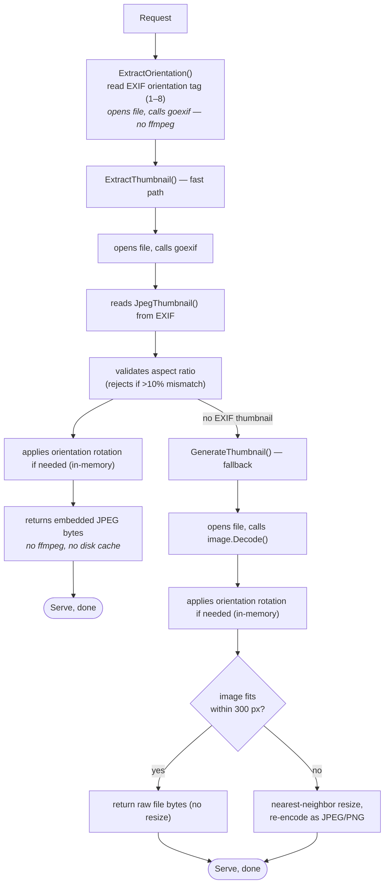
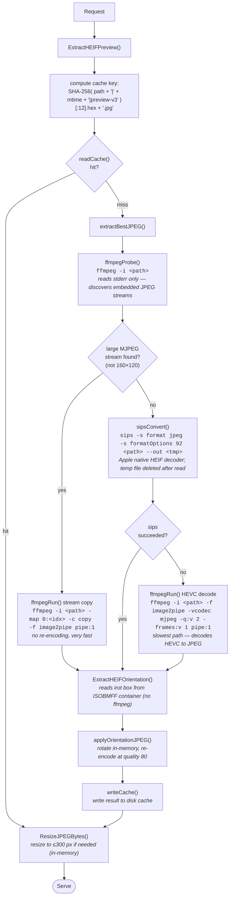
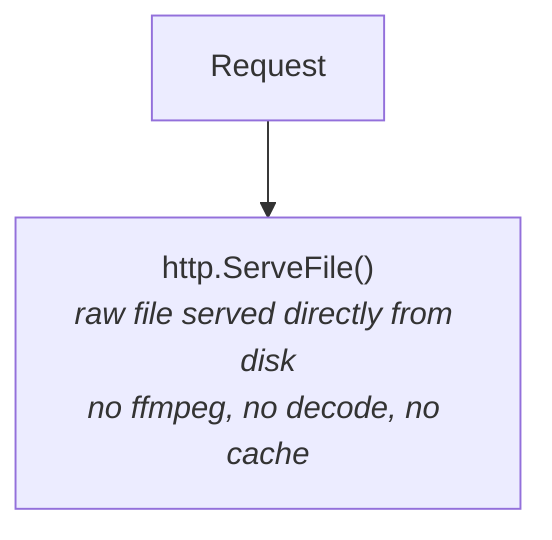
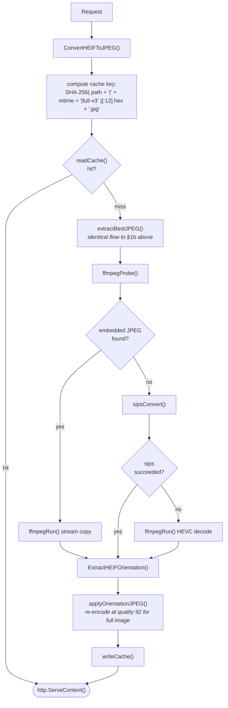

# Image Processing Flow: Thumbnails, Full Images, ffmpeg, and Caching

*Last modified: 2026-03-25*

This document describes the exact runtime behavior for every code path that
produces image data for the browser — from the HTTP request to the bytes on
the wire. It covers thumbnail generation, full-image serving, when and how
ffmpeg is called, and how the disk cache works.

---

## 1. Thumbnail requests (`GET /thumbnail?path=...`)

The handler lives in `internal/api/thumbnail.go`. `thumbnailMaxDim` is 300 px.

### 1a. Non-HEIF files (JPEG, PNG, GIF, WebP)



**No ffmpeg is ever called for non-HEIF thumbnails.**
**Nothing is written to disk** (no cache, consistent with ADR-0002).

### 1b. HEIF/HEIC/HIF files



---

## 2. Full-image requests (`GET /image?path=...`)

The handler lives in `internal/api/image.go`.

### 2a. Non-HEIF files



### 2b. HEIF/HEIC/HIF files



Note: thumbnails and full images use **different cache keys** (`preview-v3` vs
`full-v3`), so the first full-image view of a HEIF file is always a cache miss
even if the thumbnail was already generated.

---

## 3. ffmpeg invocations — complete list

| Call site | Command | When | Notes |
|---|---|---|---|
| `CheckFFmpeg()` | `ffmpeg -decoders` | Once at startup | Checks availability + HEVC decoder support; result cached for process lifetime |
| `ffmpegProbe()` | `ffmpeg -i <path>` | Per HEIF request (cache miss) | Reads stderr; always exits non-zero; used to detect embedded JPEG streams |
| `ffmpegRun()` stream copy | `ffmpeg -i <path> -map 0:<idx> -c copy -f image2pipe pipe:1` | Per HEIF request (cache miss, embedded JPEG found) | Fast; no re-encode |
| `ffmpegRun()` HEVC decode | `ffmpeg -i <path> -f image2pipe -vcodec mjpeg -q:v 2 -frames:v 1 pipe:1` | Per HEIF request (cache miss, no embedded JPEG, sips also failed) | Slowest path |

`sips` (macOS only) is tried between the two `ffmpegRun` calls. It writes to
a unique OS temp file that is deleted immediately after reading.

**No ffmpeg is called on a cache hit.** After the first successful conversion,
subsequent requests for the same file (same mtime) are served entirely from
the disk cache with no subprocess invocation.

---

## 4. Disk cache

### Location

```
os.TempDir() + "/unterlumen-cache/"
```

On macOS this is typically `/var/folders/<user-specific>/T/unterlumen-cache/`.
On Linux: `/tmp/unterlumen-cache/`.

The directory is created on first use with permissions `0700`.

### Cache key

```
SHA-256( absolutePath + "|" + mtime + "|" + purpose )[:12]  →  hex string + ".jpg"
```

- `purpose` is either `"full-v3"` (full-resolution image) or `"preview-v3"` (thumbnail source before resize)
- Including `mtime` means the cache is effectively **content-addressed by modification time**: if the source file changes, a new entry is created automatically (the old entry is orphaned, not deleted)

### Cache scope

Only HEIF conversions are cached to disk. Non-HEIF thumbnails and full images
are never written to disk (see §1a and §2a).

### Cache lifetime and cleanup

| Aspect | Behavior |
|---|---|
| Survives process restart | Yes — files remain in the OS temp directory |
| Invalidated on file change | Yes — mtime change produces a new key; old entry becomes orphaned |
| Explicit cleanup | No — unterlumen does not delete cache files |
| OS-managed cleanup | Yes — macOS and Linux periodically purge stale temp files |
| Maximum size | Unbounded; each HEIF file produces up to two `.jpg` files (`full-v3` + `preview-v3`) |

There is no housekeeping, LRU eviction, or TTL logic within unterlumen.
Cleanup is delegated entirely to the operating system's temp-directory policy.

---

## 5. Summary table

| Format | Thumbnail source | Full image | ffmpeg? | Disk cache? |
|---|---|---|---|---|
| JPEG (with EXIF thumb) | EXIF embedded thumbnail | Raw file served | No | No |
| JPEG (no EXIF thumb) | Server-side decode + resize | Raw file served | No | No |
| PNG / GIF / WebP | Server-side decode + resize | Raw file served | No | No |
| HEIF/HEIC/HIF | ffmpeg / sips conversion (cached) | ffmpeg / sips conversion (cached) | Yes (on cache miss) | Yes (`$TMPDIR/unterlumen-cache/`) |

---

## 6. Related decisions

- **ADR-0002** — No write side-effects in the photo directory; the temp cache satisfies this by writing to `$TMPDIR` instead
- **ADR-0003** — EXIF embedded thumbnails as primary source for JPEG
- **ADR-0004** — HEIF/HEIC support via ffmpeg shell-out (updated: disk cache added)
