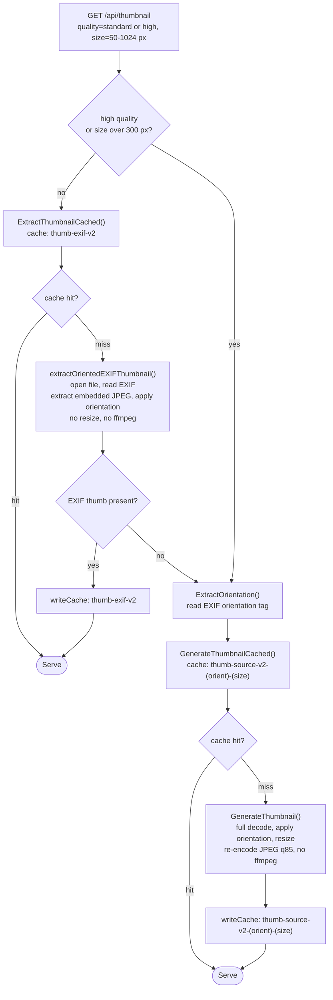
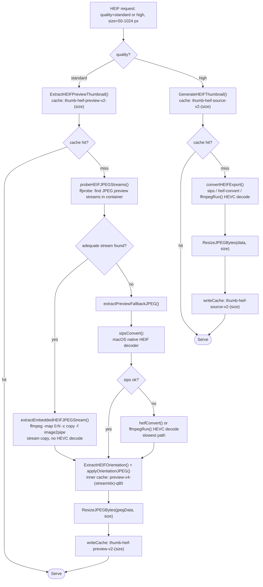
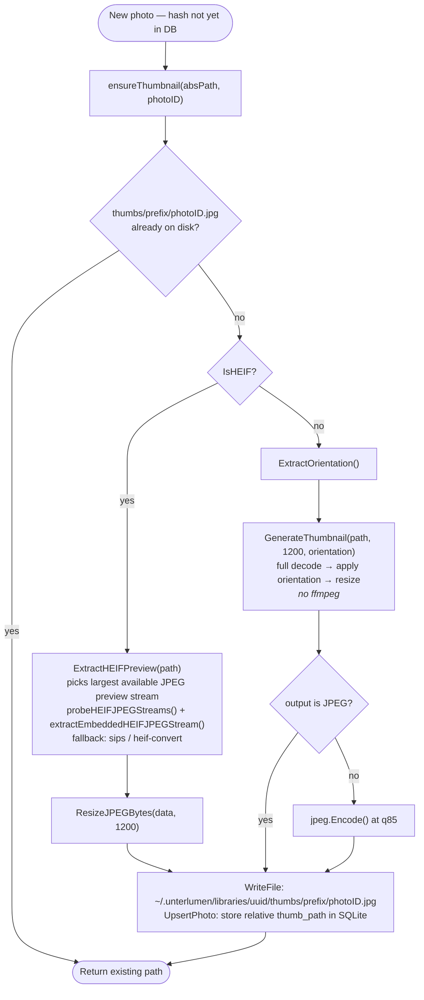
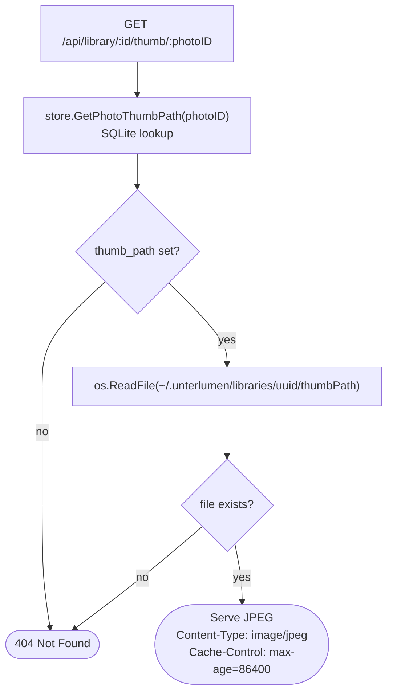
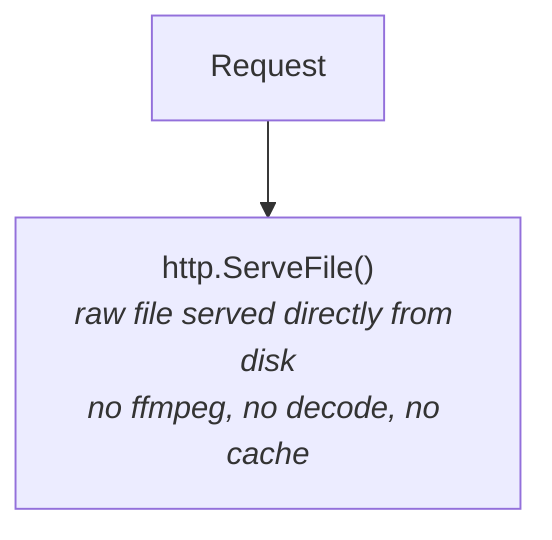
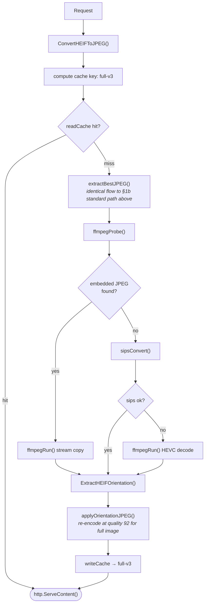

# Image Processing Flow: Thumbnails, Full Images, ffmpeg, and Caching

*Last modified: 2026-06-05*

This document describes the exact runtime behavior for every code path that
produces image data for the browser — from the HTTP request to the bytes on
the wire. It covers thumbnail generation, full-image serving, when and how
ffmpeg is called, and how the disk cache works.

---

## 1. Browse thumbnail pipeline (`GET /api/thumbnail?path=...`)

The handler lives in `internal/api/browse/thumbnail.go`. `thumbnailMaxDim` is 300 px.
The frontend sends `quality=standard` (default) or `quality=high`, and a `size` between 50 and 1024 px.

### 1a. Non-HEIF files (JPEG, PNG, GIF, WebP)



**No ffmpeg is ever called for non-HEIF thumbnails.**
Both paths write to the persistent disk cache (see §5).

### 1b. HEIF/HEIC/HIF files



---

## 2. Library thumbnail pipeline

Library thumbnails are **generated once at index time** and served directly from disk thereafter.
The endpoint is `GET /api/library/{id}/thumb/{photoID}`, handled in `internal/api/library/handler.go`.

### 2a. Generation (at index time)

Called from `ensureThumbnail()` in `internal/library/index.go` during a library scan.
Max dimension: 1200 px (`thumbMaxDim`).



### 2b. Serving



The frontend requests library thumbnails via `LibraryAPI.thumbURL(libID, photoID)` →
`/api/library/{id}/thumb/{photoID}`. In `library-pane.js`, if the photo is not yet in the DB,
the call falls back to the browse thumbnail API.

---

## 3. Full-image requests (`GET /image?path=...`)

The handler lives in `internal/api/image.go`.

### 3a. Non-HEIF files



### 3b. HEIF/HEIC/HIF files



Note: thumbnails and full images use **different cache keys** (`thumb-heif-preview-v2` vs
`full-v3`), so the first full-image view of a HEIF file is always a cache miss
even if the thumbnail was already generated.

---

## 4. External tool invocations — complete list

| Call site | Tool | Command | When | Notes |
|---|---|---|---|---|
| `CheckFFmpeg()` | ffmpeg | `ffmpeg -decoders` | Once at startup | Checks availability + HEVC decoder support; result cached for process lifetime |
| `probeHEIFJPEGStreamsWithFFProbe()` | ffprobe | `ffprobe -v error -select_streams v -show_entries stream=index,codec_name,width,height -of json <path>` | Per HEIF request (cache miss) | Enumerates embedded JPEG streams; no decode. Fails for HEIF files with no ISOBMFF moov atom (e.g. standard Fujifilm HEIC). |
| `parseHEIFJPEGStreams()` (fallback) | ffmpeg | `ffmpeg -i <path>` (stderr parse) | Per HEIF request (ffprobe failed) | Parses stream info from ffmpeg's error output; no decode |
| `extractEmbeddedHEIFJPEGStream()` | ffmpeg | `ffmpeg -i <path> -map 0:<idx> -c copy -f image2pipe pipe:1` | Per HEIF request (cache miss, adequate stream found) | Fast; no re-encode |
| `heifConvert()` | heif-convert | `heif-convert <path> <tmpdir>/out.jpg` | Per HEIF request (cache miss, no adequate stream, sips failed) | Uses libheif native decoder; handles HEIF files ffmpeg cannot parse. Reads first file in output directory to support multi-image HEIC. |
| `ffmpegRun()` HEVC decode | ffmpeg | `ffmpeg -i <path> -f image2pipe -vcodec mjpeg -q:v 2 -frames:v 1 pipe:1` | Per HEIF request (cache miss, no adequate stream, sips and heif-convert also failed) | Slowest path; cannot decode files without a parseable ISOBMFF container |

`sips` (macOS only) is tried before `heif-convert` and the ffmpeg HEVC decode. It writes to
a unique OS temp file that is deleted immediately after reading.

**Tool priority for HEIF fallback:** `sips` (macOS) → `heif-convert` → ffmpeg HEVC decode.
`heif-convert` is the most broadly capable on Linux — install `libheif-examples` (Debian/Ubuntu)
or `libheif` (Arch/Homebrew) to enable it.

**No ffmpeg is called on a cache hit.** After the first successful conversion,
subsequent requests for the same file are served entirely from the disk cache.

---

## 5. Disk cache

### Location

```
~/Library/Caches/unterlumen/    ← macOS (os.UserCacheDir())
$XDG_CACHE_HOME/unterlumen/     ← Linux with XDG
$TMPDIR/unterlumen-cache/       ← fallback
```

Determined once at startup in `getCacheDir()` (`internal/media/formats.go`).
The directory is created on first use with permissions `0700`.

### Cache key

```
SHA-256( absolutePath + "|" + purpose )[:12]  →  hex string + ".jpg"
```

- No mtime in the key — photos in libraries are read-only and NAS paths are stable
- `purpose` encodes the quality tier and parameters, e.g.:
  - `"thumb-exif-v2"` — embedded EXIF thumbnail (browse, standard, JPEG)
  - `"thumb-source-v2-{orientation}-{size}"` — generated thumbnail (browse, fallback)
  - `"thumb-heif-preview-v2-{size}"` — resized HEIF preview (browse, standard, outer)
  - `"preview-v4-{streamIdx}-q80"` — raw oriented HEIF preview JPEG (inner, any size)
  - `"thumb-heif-source-v2-{size}"` — full-decode HEIF thumbnail (browse, high)
  - `"full-v3"` — full-resolution HEIF conversion (full-image view)

### Cache scope

Browse thumbnails (both HEIF and non-HEIF) and full HEIF images are cached here.
Library thumbnails are **not** stored here — they live permanently in the library directory.

### Cache lifetime and cleanup

| Aspect | Behavior |
|---|---|
| Survives process restart | Yes — files remain on disk |
| Invalidated on file change | No — key is path-stable; stale entries are orphaned, not deleted |
| Explicit cleanup | No — unterlumen does not delete cache files |
| OS-managed cleanup | macOS may purge `~/Library/Caches/` under disk pressure |
| Maximum size | Unbounded; each HEIF file produces up to several `.jpg` files |

---

## 6. Summary table

| Mode | Format | Thumbnail source | Max dim | Cache | ffmpeg? |
|---|---|---|---|---|---|
| Browse — standard | JPEG (with EXIF thumb) | Embedded EXIF thumbnail | 300 px | `~/Library/Caches/unterlumen/` | No |
| Browse — standard | JPEG (no EXIF thumb) | Full decode + resize | 300 px | `~/Library/Caches/unterlumen/` | No |
| Browse — standard | PNG / GIF / WebP | Full decode + resize | 300 px | `~/Library/Caches/unterlumen/` | No |
| Browse — standard | HEIF/HEIC/HIF | Embedded JPEG preview stream copy | 300 px | `~/Library/Caches/unterlumen/` | Yes (ffprobe + stream copy) |
| Browse — high | Any non-HEIF | Full decode + resize | up to 1024 px × DPR | `~/Library/Caches/unterlumen/` | No |
| Browse — high | HEIF/HEIC/HIF | Full HEVC decode + resize | up to 1024 px × DPR | `~/Library/Caches/unterlumen/` | Yes (HEVC decode) |
| Library | Any non-HEIF | Full decode + resize (at index time) | 1200 px | `~/.unterlumen/libraries/uuid/thumbs/` | No |
| Library | HEIF/HEIC/HIF | Largest embedded JPEG preview (at index time) | 1200 px | `~/.unterlumen/libraries/uuid/thumbs/` | Yes (ffprobe + stream copy) |
| Full image | Non-HEIF | Raw file | original | None | No |
| Full image | HEIF/HEIC/HIF | Best JPEG preview / HEVC decode | original | `~/Library/Caches/unterlumen/` | Yes (on cache miss) |

---

## 7. Related decisions

- **ADR-0002** — No write side-effects in the photo directory
- **ADR-0003** — EXIF embedded thumbnails as primary source for JPEG
- **ADR-0004** — HEIF/HEIC support via ffmpeg shell-out
- **ADR-0014** — Thumbnail quality tiers (Standard / High)
