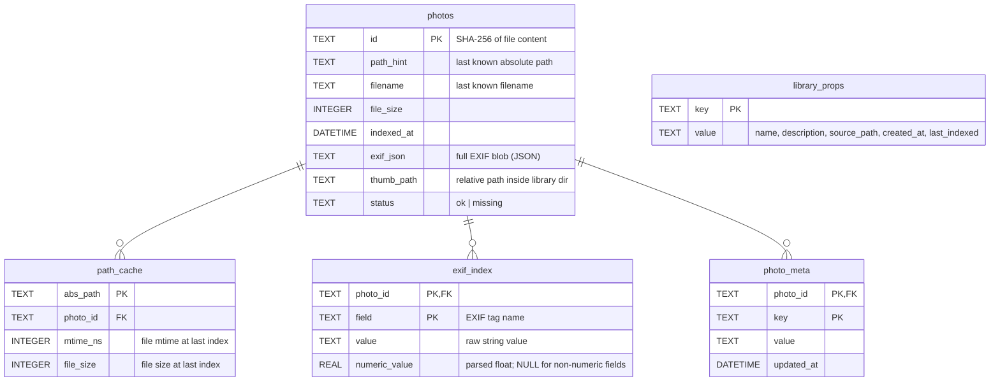
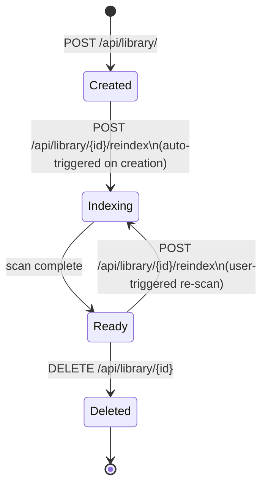
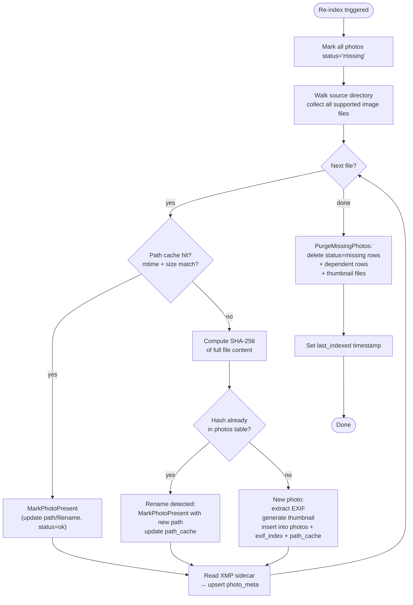
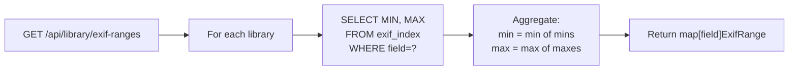

# Library Internals

*Last modified: 2026-05-02*

A deep-dive reference for how Unterlumen libraries work: what they are, how they are stored on disk, how indexing works, and how cross-library search is assembled.

---

## 1. What Is a Library?

A **library** is a managed, indexed view of a folder of photos. It does not copy or move the original files — it only reads them. All derived data (thumbnails, EXIF index, metadata) lives in a separate directory managed by Unterlumen.

One folder can be linked to exactly one library. Multiple libraries can coexist and are searched together in the cross-library search panel.

---

## 2. File System Layout

```
~/.unterlumen/
└── libraries/
    └── <uuid>/                  ← one directory per library
        ├── library.db           ← SQLite database (all index data)
        └── thumbs/
            ├── ab/
            │   └── ab3f9c….jpg  ← thumbnail (named by photo SHA-256)
            └── ff/
                └── ff02a1….jpg
```

The `<uuid>` is a randomly generated UUID v4 assigned at creation time and never changes. The original photo files remain untouched in their source directory.

XMP sidecar files live alongside the original photos, not inside the library directory:

```
/path/to/photos/
├── DSC_0001.jpg
├── DSC_0001.xmp    ← written by Unterlumen when a photo is published
└── DSC_0002.heic
```

---

## 3. Database Schema

Each library has its own SQLite file (`library.db`). The schema has five tables.



### Key design decisions

| Table | Purpose |
|---|---|
| `photos` | One row per unique photo (identity = SHA-256). Survives renames. |
| `path_cache` | Fast re-index shortcut: if mtime + size match, skip full re-read. |
| `exif_index` | Flat key/value store for every EXIF tag; numeric fields also have a parsed `numeric_value` for range queries. |
| `photo_meta` | User-visible metadata written by Unterlumen (currently: publication history from XMP sidecar). |
| `library_props` | Library-level config: name, description, source path, timestamps. Also caches `photo_count` (updated after each re-index) to avoid a full table scan on the library overview page. |

An index on `photos(status)` (`photos_status_idx`) is created at schema init (and applied as a migration to existing databases) so `COUNT … WHERE status='ok'` hits only the index, not the fat `exif_json` rows.

---

## 4. Library Lifecycle



**Creation** allocates the UUID, creates the directory structure and SQLite file, and writes library properties. It does **not** start indexing — that is a separate step triggered immediately after in the UI.

**Deletion** removes the entire library directory (`os.RemoveAll`). Original photos are never touched.

---

## 5. Indexing in Detail

### 5.1 Overview



### 5.2 Photo Identity

A photo's identity is its **SHA-256 hash** of the full file content. This means:

- **Rename** → same hash → same DB record; path and filename updated, all history preserved
- **Copy to new location** → same hash → treated as the same photo (first path wins in cache; second path also resolves to the same record)
- **EXIF edited externally** → file bytes change → new hash → new DB record with fresh EXIF; old record is purged at end of scan

### 5.3 The Fast Path

The `path_cache` table is the performance key. For every file previously seen:

```
abs_path  →  (photo_id, mtime_ns, file_size)
```

On re-scan, if the file's current `mtime` and `size` match the cache, the photo is considered unchanged. Unterlumen flips it back to `status='ok'` and moves on — no file read, no EXIF parse, no hashing. A large library re-scan is therefore mostly a directory walk plus status updates.

### 5.4 EXIF Indexing

Raw EXIF is stored in two forms:

1. **`exif_json`** on the `photos` row — the full structured blob from goexif, used by the info panel to display all available fields.
2. **`exif_index`** rows — one row per EXIF tag, with the raw string value. Five fields are additionally parsed into a `numeric_value` float for range queries:

| EXIF field | Parser | Unit |
|---|---|---|
| `ExposureTime` | rational or decimal | seconds |
| `FNumber` | rational, decimal, `f/N` | f-stop |
| `FocalLength` | rational, decimal, `N mm` | mm |
| `FocalLengthIn35mmFilm` | integer | mm (35mm equiv.) |
| `ISOSpeedRatings` | integer | ISO |

The virtual field `FocalLength35` is not stored — it is computed at query time as `FocalLengthIn35mmFilm` where available, falling back to `FocalLength`.

### 5.5 Thumbnails

Thumbnails are stored in `thumbs/<first-2-chars-of-hash>/<full-hash>.jpg`. They are generated once on first index and reused on subsequent re-scans (the thumbnail file's existence is checked by path, not regenerated).

For HEIF/HEIC files the embedded JPEG preview is extracted and resized. All other formats go through the standard thumbnail pipeline. Max dimension: 1200 px on the long edge.

### 5.6 XMP Sidecars and photo_meta

When a photo is published to a channel, Unterlumen writes a `.xmp` sidecar file next to the original photo:

```xml
<ul:Publications>
  <rdf:Bag>
    <rdf:li rdf:parseType="Resource">
      <ul:Channel>instagram</ul:Channel>
      <ul:PublishedAt>2026-04-29T12:00:00Z</ul:PublishedAt>
    </rdf:li>
  </rdf:Bag>
</ul:Publications>
```

On every index (including re-scans), the sidecar is read and its publication records are written into `photo_meta`. This means publication history survives even if the library DB is deleted and recreated — the XMP on disk is the source of truth.

### 5.7 Post-Scan Purge

After all files have been visited, any photo still at `status='missing'` was not found in the source directory. Unterlumen deletes:

1. Its rows in `path_cache`, `exif_index`, `photo_meta` (in a single transaction)
2. The `photos` row itself
3. The thumbnail file from disk

This keeps the DB and `thumbs/` directory in sync with the actual contents of the source folder.

---

## 6. Re-Index Idempotency

Re-scanning is always safe to run multiple times or to retry after an interruption:

- `MarkAllMissing` runs first, so a partial previous scan leaves no phantom `ok` records.
- Files already indexed hit the fast path (no re-read), making retry nearly instant for the portion already processed.
- The purge only runs when the scan finishes cleanly, so an interrupted scan does not delete any records.
- No new library is created on retry — the same UUID and DB are reused.

---

## 7. Cross-Library Search

The search panel can query all libraries simultaneously. The `Manager` orchestrates this in memory:

```mermaid
flowchart LR
    Request["GET /api/library/search\n?FocalLength_min=24&Model=iPhone+6s"] --> Parse["Parse text + numeric filters"]
    Parse --> ForEach["For each library\n(sequential, SQLite single-conn)"]
    ForEach --> Query["store.ListPhotos(\n  textFilters, numericFilters\n)"]
    Query --> SQL["SQL: WHERE EXISTS exif_index\nfor each active filter"]
    SQL --> Partial["Partial result + total count\nper library"]
    Partial --> Merge["Merge all results\nSort by indexed_at DESC"]
    Merge --> Page["Apply offset + limit"]
    Page --> Response["JSON response"]
```



Each library is queried independently (SQLite is single-connection). Results are merged in memory and sorted by `indexed_at` descending before the requested page is sliced out. The `total` field in the response is the sum of per-library match counts, not the size of the returned slice.

### EXIF Range Aggregation

The filter sliders show the min/max range for each field across the selected libraries. This is computed by calling `GetExifRanges` on each library and taking the global min/max:



The virtual `FocalLength35` field uses a JOIN-based COALESCE query instead of the simple MIN/MAX:

```sql
SELECT MIN(COALESCE(fl35.numeric_value, fl.numeric_value)),
       MAX(COALESCE(fl35.numeric_value, fl.numeric_value))
FROM   photos p
LEFT JOIN exif_index fl35 ON fl35.photo_id = p.id
       AND fl35.field = 'FocalLengthIn35mmFilm' AND fl35.numeric_value IS NOT NULL
LEFT JOIN exif_index fl   ON fl.photo_id  = p.id
       AND fl.field  = 'FocalLength'           AND fl.numeric_value  IS NOT NULL
WHERE  p.status = 'ok'
  AND  COALESCE(fl35.numeric_value, fl.numeric_value) IS NOT NULL
```

---

## 8. Folder Browsing

The library pane presents the library's source folder as a navigable tree. It does **not** call the general browse API — that would spawn a background goroutine reading every file over SMB to extract EXIF, saturating NAS bandwidth and delaying the first photo open by minutes.

Instead, the pane calls `GET /api/library/{id}/browse?path=<relPath>`, which queries the DB:

```
SELECT id, path_hint, filename, file_size, indexed_at
FROM photos
WHERE status='ok' AND path_hint LIKE '<folderAbs>/%'
```

Go code then partitions results into:

- **Immediate subfolders** — entries whose `path_hint` contains a `/` after the prefix (only the first path component is returned, de-duplicated).
- **Direct photos** — entries whose `path_hint` contains no `/` after the prefix.

### Path scoping

The `path` query parameter is always **relative to the library's own `source_path`**, not the server's photo root. The handler reads `source_path` from `library_props` and resolves the parameter with `pathguard.SafePath(sourcePath, relPath)`. This means:

- Libraries on a NAS or any path outside the server root work correctly.
- The frontend breadcrumb shows a clean relative path (e.g., `Root / 2024 / June`).
- Updir navigation stops at the library root (`path=""`) — the user cannot navigate above it.

No filesystem reads occur. Thumbnail URLs resolve to `/api/library/{id}/thumb/{photoID}` (pre-cached local JPEG). Full images stream from `/api/library/{id}/photo/{photoID}` — a single NAS read only when the user actually opens a photo.

---

## 9. API Surface

| Method | Route | Description |
|---|---|---|
| `GET` | `/api/library/` | List all libraries |
| `POST` | `/api/library/` | Create a new library |
| `GET` | `/api/library/{id}` | Get library metadata + photo count |
| `DELETE` | `/api/library/{id}` | Delete library (original files untouched) |
| `POST` | `/api/library/{id}/reindex` | Start re-index; streams `Progress` JSON |
| `GET` | `/api/library/{id}/browse` | Folder-level browse: subfolders + direct photos from DB |
| `GET` | `/api/library/{id}/photos` | Flat filtered/paginated photo list |
| `GET` | `/api/library/{id}/exif-ranges` | Min/max for each numeric EXIF field |
| `GET` | `/api/library/{id}/thumb/{photoID}` | Serve thumbnail by photo ID |
| `GET` | `/api/library/{id}/thumb-by-path` | Resolve thumbnail by file path |
| `GET` | `/api/library/{id}/photo/{photoID}` | Serve full-size photo |
| `GET` | `/api/library/{id}/photo/{photoID}/info` | Full EXIF + metadata for one photo |
| `GET` | `/api/library/{id}/photo/{photoID}/meta` | Read user metadata |
| `PUT` | `/api/library/{id}/photo/{photoID}/meta` | Write user metadata |
| `DELETE` | `/api/library/{id}/photo/{photoID}/meta` | Delete user metadata key |
| `POST` | `/api/library/{id}/publish` | Publish photos to a channel |
| `GET` | `/api/library/search` | Cross-library filtered search |
| `GET` | `/api/library/exif-ranges` | Aggregated EXIF ranges across libraries |
| `GET` | `/api/library/exif-values` | Distinct string values for a field |
